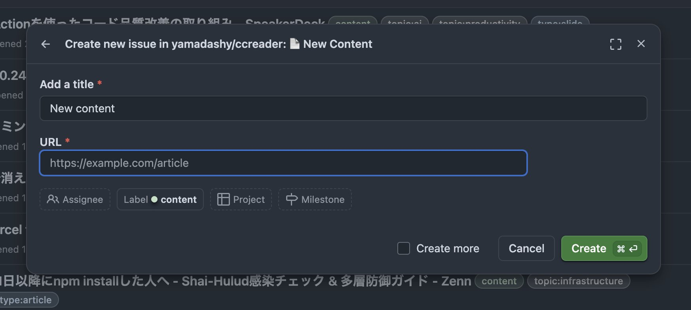
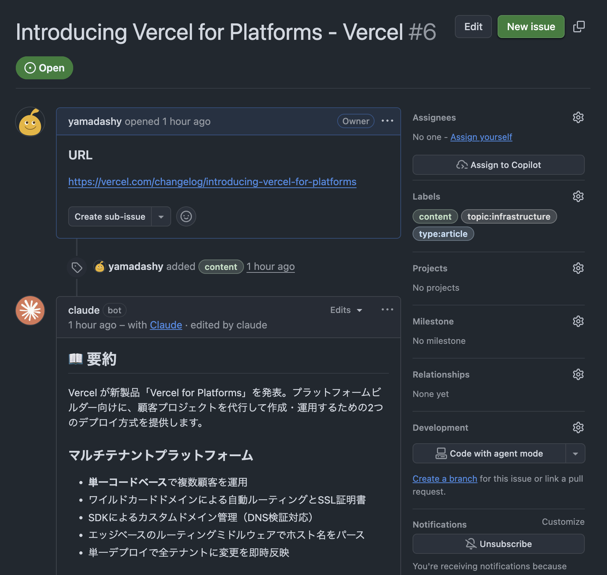
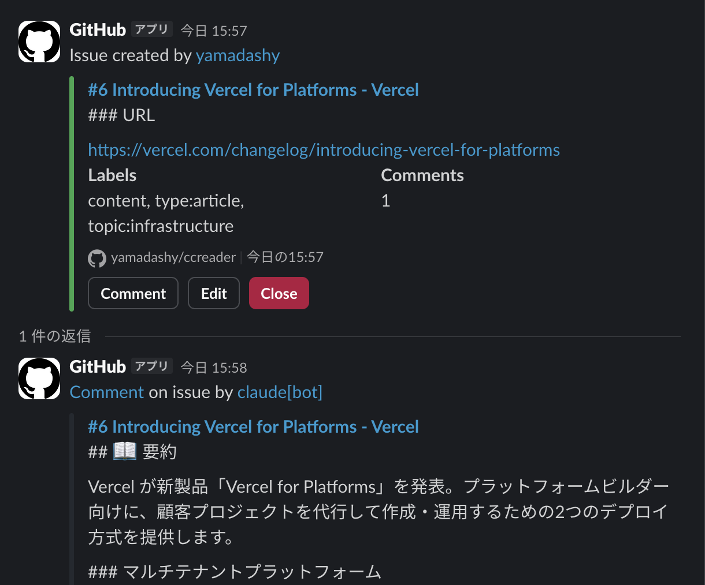

# ccreader

GitHub Issue + Claude Code Action で「あとで読む」を管理する実験的なリポジトリ

## 使い方

1. `New Issue` > `New Content` から記事などの URL を入力して Issue を作成
  
2. Claude Code Action によって、タイトル・要約・ラベル付与・関連 Issue 検索などの結果がコメントされる
  
3. 読了したら Issue を Close

以下のようなURLをブックマークしておくと追加しやすい

https://github.com/yamadashy/ccreader/issues/new?template=new-content.yml

### セットアップ

1. リポジトリをフォーク
2. Claude Code で `/install-github-app` を実行し Secrets に登録
3. Claude Code で `/ccreader:sync-labels` を実行し、ラベルを同期

### Slack 連携

Slack に GitHub アプリをインストールし、Issueイベントを通知するチャンネルを作成

以下のコマンドを実行し、通知設定を行う

```
/github subscribe yamadashy/ccreader issues,comments
```



## 仕様

### 処理内容

Issue 作成時に Claude が自動で以下を実行

1. URL からコンテンツを取得
2. タイトル・要約・補足情報を生成
3. タイプ・トピックを判定してラベル付与
4. 関連 Issue を検索（最大5件）
5. コメントに要約を投稿

### 対応サイト

| サイト | 読み取り方法 |
|--------|-------------|
| 一般的なサイト | WebFetch で取得 |
| GitHub リポジトリ | `gh` コマンド + DeepWiki MCP |
| SpeakerDeck | PDF ダウンロード + Read ツール |
| arXiv | PDF ダウンロード + Read ツール |

各サイトの詳細な読み取り方法は Agent Skills（[.claude/skills/](.claude/skills/)）で定義

### ラベル

[.github/labels.yml](.github/labels.yml) を参照

トピックはコンテンツの内容に応じて動的に追加される

## License

MIT
